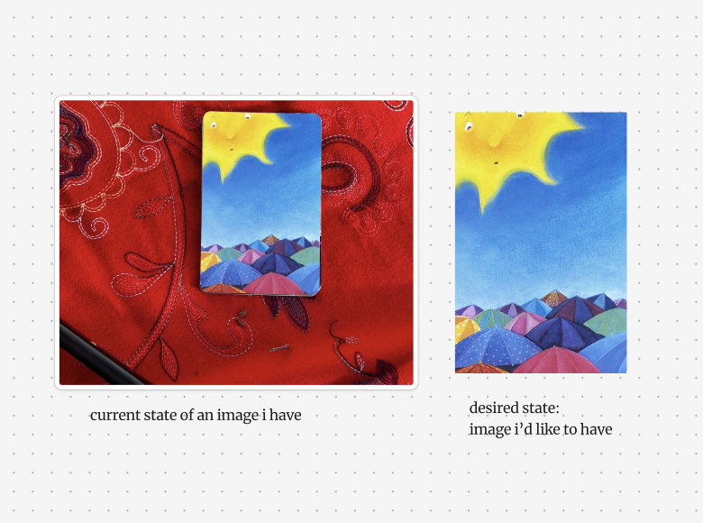
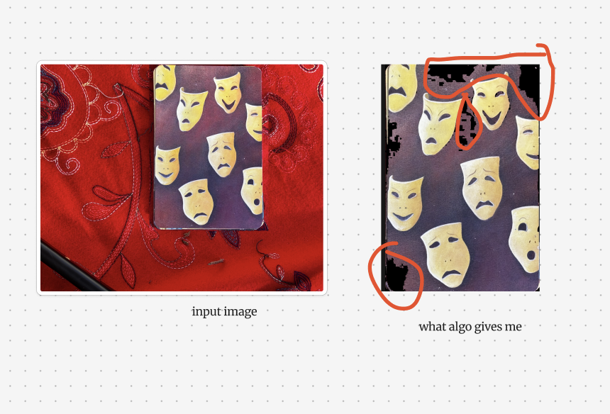

### image processor for card cutting 
by svitlana.me and ayishka cursor

### two versions: 
1. **cookie cutter:** asks you to identify the 4 corners of the card on the template image.  applies these corners to all images in the input folder. asks you to confirm the corners are correct and only leave the images that are cut correctly. repeats until all images are cut correctly. 

to make it work, you need: 
- input/ folder with all the images you want to cut

2. **card processor:** uses some fancy detection to find the corners of the card and then cuts the card. didnt work properly bc it kept cutting out the red-like areas of the card that i wanted to keep.
below is an example of such black stain.

